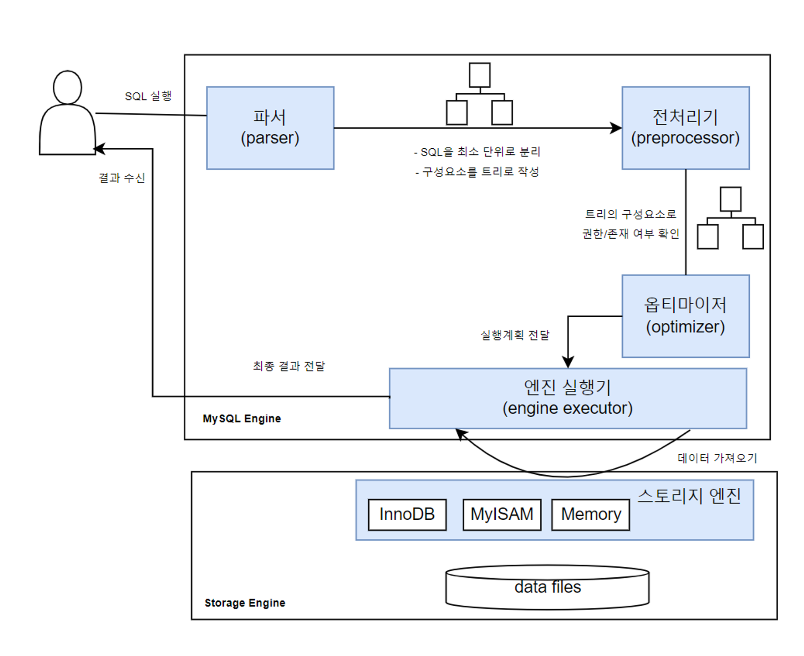

# [인프런] 업무에 바로 쓰는 SQL 튜닝

<br><br>
## 사전 준비
### MySQL 설치
- 도커로 설치
    - docker pull mysql
- 컨테이너 실행
    - docker run --name mysql-container -e MYSQL_ROOT_PASSWORD=1234 -d -p 3306:3306 mysql
- 파일 실행을 위한 환경설정
  - ```
    -- 컨테이너 접속
    docker exec -it mysql-container bash
    
    -- 계정 접속
    mysql -uroot -p

    -- 권한 설정
    GRANT ALL PRIVILEGES ON *.* TO 'root'@'%' IDENTIFIED BY 'admin' WITH GRANT OPTION;
    
    -- 설정 적용
    FLUSH PRIVILEGES;
    ```
### 실습 데이터 추가
- 실습 데이터 경로
  - https://github.com/7e7ey/Lecture-SQLtune.kit/tree/main/ch01-실습환경
- 데이터 추가
  - ```
    docker exec -i mysql-container mysql -uroot -p1234 < /Users/choi/Downloads/tmp/data_setting.sql
    docker exec -i mysql-container mysql -uroot -p1234 < /Users/choi/Downloads/tmp/dept.sql
    docker exec -i mysql-container mysql -uroot -p1234 < /Users/choi/Downloads/tmp/emp.sql
    docker exec -i mysql-container mysql -uroot -p1234 < /Users/choi/Downloads/tmp/grade.sql
    
    docker exec -i mysql-container mysql -uroot -p1234 < /Users/choi/Downloads/tmp/emp_hist1.sql
    docker exec -i mysql-container mysql -uroot -p1234 < /Users/choi/Downloads/tmp/emp_hist2.sql
    
    docker exec -i mysql-container mysql -uroot -p1234 < /Users/choi/Downloads/tmp/sal1.sql
    docker exec -i mysql-container mysql -uroot -p1234 < /Users/choi/Downloads/tmp/sal2.sql
    docker exec -i mysql-container mysql -uroot -p1234 < /Users/choi/Downloads/tmp/sal3.sql
    docker exec -i mysql-container mysql -uroot -p1234 < /Users/choi/Downloads/tmp/sal4.sql
    docker exec -i mysql-container mysql -uroot -p1234 < /Users/choi/Downloads/tmp/sal5.sql
    docker exec -i mysql-container mysql -uroot -p1234 < /Users/choi/Downloads/tmp/sal6.sql
    ```

<br>

## 학습정리
### 물리엔진
- 
  - 구성
    - MySQL의 엔진은 크게 MySQL 엔진과 스토리지 엔진으로 구분된다.
    - MySQL 엔진
      - MySQL 엔진은 사용자가 요청한 SQL문을 넘겨받은 뒤 SQL 문법 검사와 적절한 오브젝트 활용 검사를 한다.
      - SQL 문을 최소 단위로 분리하여 원하는 데이터를 빠르게 찾는 경로를 모색하는 역할을 수행한다.
    - 스토리지 엔진
      - 사용자가 요청한 SQL문을 토대로 DB에 저장된 디스크나 메모리에서 필요한 데이터를 가져오는 역할을 수행한다.
      - 일반적으로 온라인상의 트랜잭션 발생으로 데이터를 처리하는 OLTP(online transaction processing) 환경이 대다수인 만큼 주로 InnoDB 엔진을 사용한다.

### SQL문 수행 절차
- 
  - 실행순서
    1. 파서
      - 파서는 MySQL 엔진에 포함되는 오브젝트로, SQL문을 최소 단위로 분리하고 트리를 만든다.
      - 문법 검사도 수행한다.
    2. 전처리기
      - 파서에서 생성한 트리를 토대로 SQL문의 구조적 문제를 파악한다.
    3. 옵티마이저
      - 전달된 파서 트리를 토대로 필요하지 않은 조건 제거, 연산 과정 단순화한다.
      - 테이블 접근 순서, 인덱스 사용 여부, 사용 인덱스 선택, 정렬시 인덱스/임시 테이블 중 사용 결정과 같은 실행 계획 수립한다.
    4. 엔진 실행기
      - MySQL 엔진과 스토리지 엔진 영역 모두에 걸치는 오브젝트로, 옵티마이저에서 수립한 실행 계획을 참고하여 스토리지 엔진에서 데이터를 가져온다.
      - 데이터 가공(필터링 등) 작업을 수행한다.
      - MySQL 엔진의 부하를 줄이려면 스토리지 엔진에서 가져오는 데이터양을 줄이는 게 중요하다.

### 서브쿼리
- 서브쿼리란?
  - 쿼리 안에 포함된 쿼리를 일컫는다.
- 위치에 따른 서브쿼리
  - ```
    SELECT (SELECT ... FROM ...) -- 스칼라 서브 쿼리 (SELECT 절)
    FROM (SELECT ... FROM ...) -- 인라인 뷰 (FROM 절)
    WHERE 컬럼명 IN (SELECT ... FROM ...) -- 중첩 서브 쿼리 (WHERE 절)
    ```
- 관계성에 따른 서브쿼리
  - 비상관 서브쿼리
    - 메인쿼리와 서브쿼리의 관계가 없는 경우를 지칭
    - ```
      SELECT ...
      FROM 학생
      WHERE ... IN (SELECT ... FROM 지도교수)
      ```
  - 상관 서브쿼리
    - 메인쿼리와 서브쿼리의 관계가 있는 경우를 지칭
    - ```
      SELECT ...
      FROM 학생
      WHERE ... IN (SELECT ... FROM 지도교수 WHERE 학생.학번 = ...)
      
      // 지도교수 테이블의 WHERE 절에 학생 테이블의 컬럼이 사용된다.
      ```
- 반환결과에 따른 서브쿼리
  - 단일행 서브쿼리
    - ```
      SELETE ...
      FROM 학생
      WHERE 학번 = (SELECT MAX(학번) 최대학번 FROM 학생)
      ```
  - 다중행 서브쿼리
    - ```
      SELETE ...
      FROM 학생
      WHERE 학번 IN (SELECT MAX(학번) 전공별 최대학번 FROM 학생 GROUP BY 전공코드)
      ```
  - 다중열 서브쿼리
    - ```
      SELETE ...
      FROM 학생
      WHERE (이름, 전공코드) IN (SELECT 이름, 전공코드 FROM 학생 WHERE 이름 LIKE '김%')
      ```

### 테이블에 접근하는 선후 관계(Driving, Driven Table)
- 기본개념
  - 아래와 같이 조인하는 테이블이 있을 때, DB엔진은 동시에 여러 테이블에 접근을 할 수가 없다. 때문에 DB엔진은 여러 개의 테이블들을 내부적으로 순서를 정한 후 순차적으로 접근하여 데이터를 조회하고 이후 그 결과를 다음 테이블로 전달해서 조인을 수행하게 된다.
  - 이 때, 가장 먼저 접근하는 테이블을 Driving 테이블이라고 하고 나중에 접근하게 되는 테이블을 Driven 테이블이라고 한다.
- Driving 테이블이 중요한 이유
  - Driving 테이블에서 추출된 결과를 가지고 Driven 테이블에 접근하기 때문에, Driving 테이블에서 추출된 결과가 작을수록 성능상 유리하다.

### 조인 알고리즘
- 두 개의 테이블을 결합하는 조인의 원리는 크게 2가지로 나눌 수 있다.
  - Nested Loop Join(=NL)
    - 가장 기본적인 조인 방식
    - 드라이빙 테이블의 각 행마다 드리븐 테이블을 탐색
    - 인덱스가 있으면 효율적, 소량 데이터에 유리
    - 일반적으로 중첩 반복 구조
  - Hash Join
    - 해시 테이블을 만들어 조인
    - 주로 등가 조인(=)에 사용
    - 대량의 데이터를 처리할 때 효율적
    - 인덱스가 없어도 빠름

### 오브젝트 스캔의 유형
- 원하는 데이터를 찾기위한 스캔 유형에는 테이블 스캔과 인덱스 스캔이 있다.
  - 테이블 스캔
    - Table Full Scan
      - 인덱스를 거치지 않고 테이블로 접근하여, 처음부터 끝까지 데이터를 접근하는 방식
  - 인덱스 스캔
    - Index Range Scan
      - 인덱스를 특정한 범위까지 스캔한 뒤, 스캔 결과를 토대로 테이블의 데이터를 접근하는방식
      - BETWEEN, <, >, <=, >=, LIKE 등이 사용되면 Range Scan이 적용될 수도 있다.
    - Index Full Scan
      - 인덱스만 처음부터 끝까지 스캔하는 방식
      - 테이블은 접근하지 않는다.
      - 조회에 사용되는 쿼리가 인덱스를 구성하는 컬럼만 사용될 경우 이 방식이 적용될 수 있다.
    - Index Unique Scan
      - 기본키나 유니크 인덱스를 통해 테이블을 스캔하는 방식
      - WHERE절에 = 조건인 경우
      - 조인 컬럼 또는 조건절의 컬럼이 PK 또는 UI의 선두 컬럼으로 사용되는 경우
    - Index Loose Scan
      - 인덱스의 필요한 부분만 골라 스캔하는 방식
      - WHERE절 조건문 기준으로 필요한 부분과 그렇지 않은 부분을 구분하여 선택적으로 스캔
    - Index Merge Scan
      - 생성된 2개의 인덱스를 통합한 후, 테이블을 스캔하는 방식
      - WHERE절 조건문에 서로 다른 인덱스를 구성하는 컬럼들로 구성되어 있는 경우

### 액세스 조건과 필터 조건
- 액세스 조건
  - 디스크에 있는 데이터에 접근할 때, 검색 범위를 줄여주는 조건 
  - 일반적으로 인덱스를 활용해 특정 레코드를 찾아가는 데 사용됨 
  - 스토리지 엔진 단계에서 조건이 적용되어, 불필요한 데이터 I/O를 줄일 수 있음
- 필터 조건
  - 액세스 조건에 의해 조회된 데이터 중에서, 추가적으로 걸러내는 조건 
  - MySQL 엔진(서버 레이어)에서 처리되며, 메모리 상의 필터링 단계에서 적용됨
- 액세스 조건 VS 필터 조건
  - 액세스 조건을 잘 활용하면 스토리지 엔진에서부터 필요한 데이터만 가져오므로 성능에 유리 
  - 반면, 필터 조건만 사용하는 경우 불필요한 데이터를 디스크에서 읽고 난 후 필터링하게 되어 리소스 낭비가 발생함 
  - 따라서 필터 조건으로 걸러지는 데이터가 많다면, 인덱스 설계나 SQL 조건 재구성이 필요한 튜닝 포인트로 볼 수 있음

### 선택도와 카디널리티
- 선택도
  - 조건을 만족하는 데이터의 비율
    - 선택도 = 선택된 레코드 수 / 전체 레코드 수 * 100
  - 값이 작을수록 더 선택적(Selective) → 인덱스 효율이 높음을 뜻한다.
- 카디널리티
  - 어떤 컬럼에 존재하는 서로 다른(distinct) 값의 개수
  - 즉, 데이터의 다양성(고유값 수)을 나타낸다.
  - 카디널리티는 '1/선택도'의 값이다.
    - 즉 카디널리티는 값이 클수록 인덱스 효율이 높음을 뜻한다.
- 정리
  - 선택도가 낮을수록, 카디널리티가 높을수록 인덱스 효율이 높음을 뜻한다.

### 기타 용어
- 힌트
  - 옵티마이저에게 빠른 경로를 알려주 정보
    - 종류
      - STRAIGHT_JOIN
        - FROM 절에 나열된 테이블 순으로 조인을 유도하는 힌트
      - USE INDEX
        - 특정 인덱스를 사용하도록 유도하는 힌트
      - FORCE INDEX
        - 특정 인덱스를 사용하도록 강하게 유도하는 힌트
      - IGNORE INDEX
        - 특정 인덱스를 사용하지 못하도록 유도하는 힌트
- 콜레이션
  - 데이터베이스에 저장된 문자값을 비교하거나 정렬하는 규칙
    - utf8mb3_bin
      - 바이너리 기반 비교
      - 대소문자 비교
        - SELECT 'a' = 'A'; -- 결과: false
      - 정렬순서
        - A → B → a → b
    - utf8mb3_general_ci
      - 일반적인 문자 비교 (대소문자 구분 없음) 
      - 대소문자 비교
        - SELECT 'a' = 'A'; -- 결과: true
      - 정렬순서
        - A = a → B = b

### 실행계획 항목
- `explain SQL`을 실행하면 실행계획 항목이 표시되며 이를 분석해 튜닝 포인트를 잡을 수 있다.
  - ex. explain SELECT COUNT(1) FROM dept;
  - 이 항목들 중 select_type, type, key, Extra는 더더욱 중요 지표가 될 수 있다.
- 실행계획 항목
  - id
    - 최소한의 단위 Select 문마다 부여되는 식별자
    - id는 1부터 시작하며, 값이 작을수록 먼저 접근한 테이블이다.
    - 값이 같다면 같은 값끼리 join을 하고 있다는 의미이다.
  - select_type
    - 쿼리문의 Select 유형을 나타내는 항목
    - 유형
      - simple
        - 서브쿼리 또는 Union 구문이 없는 단순 Select문
      - primary
        - 서브쿼리 또는 Union 구문이 포함된 쿼리문에서 최초 접근한 테이블
      - subquery
        - 독립적인 서브쿼리
      - derived
        - 단위 쿼리를 메모리나 디스크에 생성한 임시 테이블
      - union
        - Union 또는 Union All 구문에서 첫 번째 이후의 테이블
      - union result
        - Union 구문에서 중복을 제거하기 위해 메모리나 디스크에 생성한 임시 테이블
      - dependent subquery 또는 dependent union 
        - Union 또는 Union All 구문에서 메인 테이블의 영향을 받는 테이블
      - materialized
        - 조인 등의 가공 작업을 위해서 생성한 임시 테이블
  - table
    - 테이블명이 표시되며, alias를 사용하였다면 alias 값이 표시된다.
    - 서브쿼리 등을 사용하여 임시 테이블로 만들어진 경우, <derived2> 등과 같이 다른 형태로 표시가 된다.
      - select_type이 derived이며 id가 2인 테이블에 의해 만들어진 임시 테이블
  - partitions
    - 접근하게 되는 특정 파티션
    - 파티션으로 구성된 테이블일 때만 표시되는 항목이다.
  - type
    - 데이터를 어떻게 접근할 것인가에 관한 정보
      - 유형 (const -> all로 갈수록 좋지 않은 쿼리를 뜻한다.)
        - const
          - 단 1건의 데이터만 접근하는 유형
        - eq_ref
          - 조인 시 드리븐 테이블에서 매번 단 1건의 데이터만 접근하는 유형
        - ref
          - 데이터 접근 범위가 2개 이상인 유형
        - range
          - 연속되는 범위를 접근하게 되는 유형
        - index_merge
          - 특정 테이블에 생성된 2개 이상 인덱스가 병합되어 동시에 적용되는 유형
        - index
          - 인덱스를 처음부터 끝까지 접근하는 유형
          - Full Index Scan
        - all
          - 테이블을 처음부터 끝까지 접근하는 유형
          - Full Table Scan
  - possible_keys
    - 사용할 수 있는 인덱스 후보군 (큰 효용성은 없다)
  - key
    - 사용한 인덱스 명
  - key_len
    - 사용된 인덱스의 Bytes
    - 해당 정보를 통해 복합 인덱스의 경우에는 실제 인덱스로 사용된 컬럼을 유추할 수 있다. 
  - ref
    - 테이블을 접근한 조건
    - ex. emp와 grade 테이블을 조인할 때 where절이 emp.emp_id = grade.emp_id로 되어있을 경우, grade 테이블 기준으로 emp.emp_id 와 같은 형태로 표시되어 있다. (= emp 테이블이 grade 테이블로 접근할 때 emp.emp_id 조건을 통해 접근)
  - rows
    - 접근할 레코드 행의 수(예상 수치)
    - 통계정보 기반으로 예상한 것이라 100% 정확한 수치는 아니고 근사치이다.
  - filtered
    - MySQL 엔진에서 필터 조건에 의해 최종 반환되는 비율(%)
    - 100%에 가까울 수록 좋은 것이다.
      - 수치가 낮을수록 스토리지 엔진에서 가져온 데이터를 MySQL 엔진에서 추가적으로 필터링한 케이스에 해당한다. (좋지 않은 케이스)
  - Extra
    - 쿼리문을 어떻게 수행할 것인지에 대한 부가정보
      - 유형
        - Distinct
          - 중복이 제거되어 유일한 값을 찾을 때 출력되는 정보
          - distinct나 union 키워드를 사용할 때 많이 보여진다.
        - Using where
          - Where 절의 필터 조건을 사용해 MySQL 엔진으로 가져온 데이터를 추출
        - Using temporary
          - 데이터의 중간 결과를 저장하고자 임시 테이블을 생성
        - Using index
          - 물리적인 데이터 파일을 읽지않고 인덱스만 읽어 쿼리 수행
          - 커버링 인덱스(covering index)가 사용됐다는 뜻이기도 함
            - 커버링 인덱스(covering index)
              - 쿼리가 필요한 모든 데이터를 인덱스에서만 가져올 수 있는 경우를 뜻함.
              - 테이블의 실제 데이터를 읽지 않고 인덱스만으로 쿼리를 처리할 수 있는 경우.
        - Using filesort
          - order by가 인덱스를 활용하지 못하고, 메모리에 올려서 추가적인 정렬 작업을 수행
        - using index for group-by
          - 쿼리문에 Group by 구문이나 Distinct 구문이 포함될 때, 정렬된 인덱스를 순서대로 읽으면서 group by 연산 수행
        - Using index for skip scan
          - 인덱스의 모든 값을 비교하는 것이 아닌, 필요한 값만 건너뛰면서 스캔하는 방식
        - FirstMatch()
          - 인덱스 스캔 시에 첫 번째로 일치하는 레코드만 찾으면 검색을 중단하는 방식

### 실행계획 판단 기준과 실행 계획의 확장 
- 실헹계획 판단
  - 실행계획을 토대로 튜닝 대상을 판단할 수 있다.
    - 아래 항목에 대해서 왼쪽에 있는 값일수록 좋고, 오른쪽에 가까운 값일수록 튜닝대상으로 간주할 수 있다.
      - select_type
        - simple, primary (좋음) <---> dependent, uncacheable (나쁨)
      - type
        - system, const, eq_ref <---> index, all
      - extra
        - using index <---> using filesort, using temporary
- 실행 계획의 확장
  - explain에 옵션을 추가하여 더 많은 정보를 얻을수도 있다.
  - 옵션 종류
    - explain format = traditional
      - format = traditional은 default 옵션으로 생략하고 explain만 사용하는 것과 동일하다.
    - explain format = tree
      - 트리형태로 출력한다.
    - explain format = json
      - json형태로 출력한다.
    - explain analyze
      - 나머지 옵션은 통계정보 기반으로 실행계획을 출력하는데, analyze는 옵티마이저가 실제 쿼리를 수행해보고 측정된 값을 보여주기 때문에 보다 정확한 값을 확인할 수 있다. (하지만 실제 쿼리가 수행되기 때문에 속도가 느릴 수 있다.)

### 튜닝
- 기본키를 변경하는 나쁜 SQL
  - 변경 전
    - ```
      SELECT *
      FROM emp
      WHERE SUBSTRING(emp_id,1,4) = 1100
      AND LENGTH(emp_id) = 5
      ```
    - 변경 전 실행계획
      - type = ALL (=테이블 풀 스캔)
  - 변경 후
    - ```
      SELECT emp_id, birth, first_name, last_name, gender, hire_date
      FROM emp
      WHERE emp_id BETWEEN 11000 AND 11009
      ```
  - 튜닝 포인트
    - 조회하고자 하는 데이터가 궁극적으로는 emp_id가 11000 ~ 11009인 데이터이므로, 조건절을 단순하게 변경하여 PK를 활용할 수 있게 변경한다.
    - 또한 필요한 필드만 SELECT 절에 남기는 것이 좋다.
- 불필요한 함수를 포함하는 나쁜 SQL
  - 변경 전
    - ```
      SELECT IFNULL(gender,'NO DATA') gender,
      COUNT(1) count
      FROM emp
      GROUP BY IFNULL(gender,'NO DATA')
      ```
    - 변경 전 실행계획
      - type = index (=인덱스 풀 스캔)
      - I_GENDER_LAST_NAME
      - Extra = Using temporary
  - 변경 후
    - ```
      SELECT gender, COUNT(1) count
      FROM emp
      GROUP BY gender
      ```
  - 튜닝 포인트
    - 인덱스를 잘 타고 있지만, Extra를 보면 Using temporary(임시테이블 생성) 정보를 확인할 수 있다.
      - 이는 GROUP BY에 있는 함수를 실행하기 때문이다.
    - 실제 emp 테이블의 gender는 M과 F 값만 갖으며 NOT NULL 조건을 갖는 컬럼이다.
    - 함수를 사용하지 않고 단순 GROUP BY만 사용하더라도 동일한 결과가 반환되므로 불필요한 함수를 제거하여 임시테이블이 생성되지 않도록 변경한다.
- 인덱스를 활용하지 못하는 나쁜 SQL
  - 변경 전
    - ```
      SELECT COUNT(*) count
      FROM salary
      WHERE is_yn = 1
      ```
    - 변경 전 실행계획
      - type = index (=인덱스 풀 스캔)
      - key = I_IS_YN  
      - filtered = 10.0 (=MySQL엔진에서 추가 필터링을 90%나 진행)
  - 변경 후
    - ```
      SELECT COUNT(*) count
      FROM salary
      WHERE is_yn = '1'
      ```
  - 튜닝 포인트
    - is_yn은 char 형인데, 숫자로 비교를 하다보니 묵시적 형변환 발생.
      - 이 때문에 데이터를 모두 가져온 후 MySQL에서 필터링을 하고 있음.
    - 적절하게 문자로 비교하여 'filtered = 100'으로 성능 개선 (=MySQL이 아닌 스토리지엔진에서 모두 필터링되는 좋은 케이스)
- FTS(Full Table Scan) 방식으로 수행하는 나쁜 SQL
  - 변경 전
    - ```
      SELECT first_name, last_name
      FROM emp
      WHERE hire_date LIKE '1994%'
      ```
    - 변경 전 실행계획
      - type = ALL
  - 변경 후
    - ```
      SELECT first_name, last_name
      FROM emp
      WHERE hire_date BETWEEN '1994-01-01' AND '1994-12-31'
      ```
  - 튜닝 포인트
    - 쿼리의 목적은 1994년도에 해당하는 데이터를 가져오는게 목적.
    - 해당 컬럼은 date 타입이므로 between을 사용하여 날짜 범위를 조건으로 주도록 변경
      - type = range / key = I_HIRE_DATE 로 인덱스를 타도록 변경
- 컬럼을 결합해서 사용하는 나쁜 SQL
  - 변경 전
    - ```
      SELECT *
      FROM emp
      WHERE CONCAT(gender,' ',last_name) = 'M Radwan'
      ```
    - 변경 전 실행계획
      - type = ALL
  - 변경 후
    - ```
      SELECT *
      FROM emp
      WHERE gender = 'M'
      AND last_name =  'Radwan'
      ```
  - 튜닝 포인트
    - 굳이 컬럼을 결합하지 않아도, 원하는 조건으로 조회가 가능하다.
    - 그렇기 때문에 이미 존재하는 I_GENDER_LAST_NAME 인덱스를 사용할 수 있도록 쿼리를 수정한다.
- 습관적으로 중복을 제거하는 나쁜 SQL
  - 변경 전
    - ```
      SELECT DISTINCT e.EMP_ID, e.FIRST_NAME, e.LAST_NAME, s.ANNUAL_SALARY  
      FROM emp e
      JOIN salary s ON (e.emp_id = s.emp_id)
      WHERE s.is_yn = '1'
      ```
    - 변경 전 실행계획
      - salary 테이블
        - type = ref
        - key = I_IS_YN
        - extra = Using temporary
      - emp 테이블
        - type = eq_Ref
        - key = PK
  - 변경 후
    - ```
      SELECT e.EMP_ID, e.FIRST_NAME, e.LAST_NAME, s.ANNUAL_SALARY  
      FROM emp e
      JOIN salary s ON (e.emp_id = s.emp_id)
      WHERE s.is_yn = '1'
      ```
  - 튜닝 포인트
    - EMP_ID는 PK이기 때문에 중복제거를 하기위한 DISTINCT 키워드가 불필요하다.
    - DISTINCT 키워드를 제거하면 extra에서 식별되었던 Using temporary가 제거되어 성능이 향상된다.
- UNION 문으로 쿼리를 합치는 나쁜 SQL
  - 변경 전
    - ```
      SELECT 'M' AS gender, emp_id
      FROM emp
      WHERE gender = 'M'
      AND last_name ='Baba'
      
      UNION
      
      SELECT 'F', emp_id
      FROM emp
      WHERE gender = 'F'
      AND last_name = 'Baba'
      ```
    - 변경 전 실행계획
      - 첫번째 emp
        - select_type = PRIMARY
        - type = ref
        - key = I_GENDER_LAST_NAME
      - 두번째 emp
        - select_type = UNION
        - type = ref
        - key = I_GENDER_LAST_NAME
      - 세번째
        - select_type = UNION RESULT
        - type = ALL
        - extra = Using temporary
  - 변경 후
    - ```
       SELECT 'M' AS gender, emp_id
       FROM emp
       WHERE gender = 'M'
       AND last_name ='Baba'

      UNION ALL
      
      SELECT 'F', emp_id
      FROM emp
      WHERE gender = 'F'
      AND last_name = 'Baba'
      ```
  - 튜닝 포인트
    - 쿼리의 목적은 last_name이 'Baba' 라는 직원을 조회하기 위함이다.
    - gender는 M과 F만 있기 때문에 위의 쿼리와 아래의 쿼리에서 동일한 값이 나올 가능성이 없기 때문에 UNION을 사용할 이유가 없다.
      - UNION은 정렬 후 중복을 제거하는데, 중복이 일어날 가능성이 없기 때문에 사용할 이유 없음.
      - 즉, UNION ALL을 써도 무방.
    - 튜닝 후에 실행계획을 보면, 정렬 후 제거 작업이 없어지기 때문에 세번째로 식별되었던 UNION RESULT에 대한 작업이 없어진 것을 확인할 수 있다.
- 인덱스를 생각하지 않고 작성한 나쁜 SQL
  - 변경 전
    - ```
      SELECT last_name, gender, COUNT(1) as count
      FROM emp
      GROUP BY last_name, gender
      ```
    - 변경 전 실행계획
      - type = index
      - key = I_GENDER_LAST_NAME
      - extra = Using index, Using temporary
  - 변경 후
    - ```
      SELECT last_name, gender, COUNT(1) as count
      FROM emp
      GROUP BY gender, last_name
      ```
  - 튜닝 포인트
    - group by는 그룹핑을 하기 위해서는 기본적으로 인덱스를 활용하려고하는데, 현재는 last_name을 먼저 우선순위로 group by하고 gender를 다음 순서로 그룹핑하고 있다.
    - 이미 만들어진 인덱스를 활용한다고하면, I_GENDER_LAST_NAME을 제대로 활용하기 위해서 gender를 먼저 우선순위로 group by 할 수 있게 변경해준다.
      - Using temporary가 제거되어 성능 향상.
- 엉뚱한 인덱스를 사용하는 나쁜 SQL
  - 변경 전
    - ```
      SELECT emp_id
      FROM emp
      WHERE hire_date LIKE '1989%'
      AND emp_id > 100000
      ```
    - 변경 전 실행계획
      - type = ragne
      - key = PK
      - extra = Using index, Using temporary
  - 변경 후
    - ```
      SELECT emp_id
      FROM emp
      WHERE hire_date BETWEEN '1989-01-01' AND '1989-12-31'
      AND emp_id > 100000
      ```
  - 튜닝 포인트
    - hire_date 조건으로만 봤을 때 3만건 미만, emp_id 조건으로 봤을 때 21만건이 존재한다.
    - hire_date 와 관련된 인덱스인 I_HIRE_DATE를 사용하게 변경하면 더 효율적으로 튜닝할 수 있다. (모수를 줄이기 때문)
      - 1989년에 해당하는 조건을 LIKE로 잘못 걸고 있어서 인덱스를 제대로 활용하지 못한 케이스. 날짜 범위를 적절하게 비교할 수 있도록 LIKE에서 BETWEEN으로 변경.
- 잘못된 드라이빙 테이블로 수행되는 나쁜 SQL
  - 변경 전
    - ```
      SELECT de.emp_id, d.dept_id
      FROM dept_emp_mapping de,
           dept d
      WHERE de.dept_id = d.dept_id
      AND de.start_date >= '2002-03-01'
      ```
    - 변경 전 실행계획
      - dept 테이블
        - type = index
        - key = UI_DEPT_NAME
        - 먼저 접근하고 있음
        - 총 9건 존재
      - dept_emp_mapping 테이블
        - type = ref
        - key = I_DEPT_ID
        - 총 33만건 존재
  - 변경 후
    - ```
      SELECT straight_join de.emp_id, d.dept_id
      FROM dept_emp_mapping de,
           dept d
      WHERE de.dept_id = d.dept_id
      AND de.start_date >= '2002-03-01'
      ```
  - 튜닝 포인트
    - 위 쿼리는 일반적인 조인방식이며, 일반적인 조인은 nested 조인 방식을 사용한다.
      - 현재 dept 테이블을 먼저 접근하고 있기 때문에, 1개의 row에 접근한 후 33만건을 접근. 즉 9*33만 정도의 액세스가 발생함.
    - 만약 dept_emp_mapping에 걸려있는 start_date 조건으로 먼저 필터링이 된다면 1341건으로 줄게됨.
      - 이를 위해 dept_emp_mapping 테이블을 드라이빙 테이블로 지정할 수 있도록 튜닝.
- 불필요한 조인을 수행하는 나쁜 SQL
  - 변경 전
    - ```
      SELECT COUNT(DISTINCT e.emp_id) as COUNT
      FROM emp e,
           ( SELECT emp_id
             FROM entry_record
             WHERE gate = 'A'
           ) record
      WHERE e.emp_id = record.emp_id
      ```
    - 변경 전 실행계획
      - entry_record 테이블
        - type = ref
        - key = I_GATE
      - emp 테이블
        - type = eq_ref
        - key = PRIMARY
  - 변경 후
    - ```
      SELECT COUNT(e.emp_id) as COUNT
      FROM emp e
      WHERE EXISTS ( SELECT emp_id
                      FROM entry_record er
                     WHERE gate = 'A'
                       AND er.gate = e.emp_id
                   )
      ```
  - 튜닝 포인트
    - entry_record 테이블의 데이터를 알고 싶은게 아니라, 단순 entry_record의 조건을 만족하는 emp_id가 있는지의 여부만 알고 싶은 상태이다.
    - 따라서 join을 활용하는 것보다는 조건절로 판별하는 것이 더 효율적이다.
    - 또한, emp_id는 PK이므로 중복될 일이 없기 때문에 DISTINCT 키워드는 제거해도 된다.
- HAVING 절로 추가적 필터를 수행하는 나쁜 SQL
  - 변경 전
    - ```
      SELECT e.emp_id, e.first_name, e.last_name
      FROM emp e,
           salary s
      WHERE e.emp_id > 450000
      AND e.emp_id = s.emp_id
      GROUP BY s.emp_id
      HAVING MAX(s.annual_salary) > 100000
      ```
    - 변경 전 실행계획
      - emp 테이블
        - type = range
        - key = PRIMARY
        - Extra = Using temporary
      - salary 테이블
        - type = ref
        - key = PRIMARY
  - 변경 후
    - ```
      SELECT e.emp_id, e.first_name, e.last_name
      FROM emp e
      WHERE e.emp_id > 450000
      AND ( SELCT MAX(annual_salary)
             FROM salary s
            WHERE e.emp_id = s.emp_id ) > 100000
      ```
  - 튜닝 포인트
    - HAVING 절의 특성상 모든 데이터가 추출된 이후 필터링을 하는데, JOIN 시 필터링하는게 성능상 유리하므로 이 관점에서 튜닝을 진행한다.
      - 때문에 HAVING 절은 MySQL엔진에서 필터링이 이뤄짐. -> 스토리지 엔진에서 필터링이 될 수 있도록 튜닝 필요.
- 유사한 SELECT문을 여러 개 나열한 나쁜 SQL
  - 변경 전
    - ```
      SELECT 'BOSS' grade_name, COUNT(*) cnt
      FROM grade
      WHERE grade_name = 'Manager' AND end_date = '9999-01-01'
      
      UNION ALL
      
      SELECT 'TL' grade_name, COUNT(*) cnt
      FROM grade
      WHERE grade_name = 'Technique Leader' AND end_date = '9999-01-01'
      
      UNION ALL
      
      SELECT 'AE' grade_name, COUNT(*) cnt
      FROM grade
      WHERE grade_name = 'Assistant Engineer' AND end_date = '9999-01-01'
      ```
    - 변경 전 실행계획
      - 3개의 테이블이 rows가 모두 442,545
  - 변경 후
    - ```
      SELECT CASE grade_name WHEN 'Manager' THEN 'BOSS'
                             WHEN 'Technique Leader' THEN 'TL'
                             WHEN 'Assistant Engineer' THEN 'AE'
                             ELSE 'NA' END grade_name
      FROM grade
      WHERE grade_name IN ('Manager', 'Technique Leader', 'Assistant Engineer')
      AND end_date = '9999-01-01'
      ```
  - 튜닝 포인트
    - grade_name의 값만 다르고 모두 동일한 구조이므로, 매번 SELECT문을 수행할 필요가 없다.
    - 한 번의 SELECT로 변경하여 442,545 row를 한 번만 접근하도록 튜닝. (이전에는 3번을 접근하였음.)
- 소계/통계를 위한 쿼리를 반복하는 나쁜 SQL
  - 변경 전
    - ```
      SELECT region, null gate, COUNT(*) cnt
      FROM entry_record
      WHERE region <> ''
      GROUP BY region
      
      UNION ALL
      
      SELECT region, gate, COUNT(*) cnt
      FROM entry_record
      WHERE region <> ''
      GROUP BY region, gate
      
      UNION ALL
      
      SELECT null region, null gate, COUNT(*) cnt
      FROM entry_record
      WHERE region <> ''
      ```
  - 변경 후
    - ```
      SELECT region, gate, COUNT(*) count
        FROM entry_record
       WHERE region <> ''
       GROUP BY ROLLUP(region, gate)
      ```
  - 튜닝 포인트
    - 소계/집계을 할 때, 지원하는 함수가 있는지 확인하여 활용한다.
- 처음부터 모든 데이터를 가져오는 나쁜 SQL
  - 변경 전
    - ```
      SELECT e.emp_id,
             s.avg_salary,
             s.max_salary,
             s.min_salary
      FROM emp e,
           (SELECT emp_id,
                   ROUND(AVG(annual_salary),0) avg_salary,
                   ROUND(MAX(annual_salary),0) max_salary,
                   ROUND(MIN(annual_salary),0) min_salary
           FROM salary
           GROUP BY emp_id
           ) s
      WHERE e.emp_id = s.emp_id
      AND e.emp_id BETWEEN 10001 AND 10100
      ```
    - 변경 전 실행계획
      - salary 테이블의 rows가 280만건이 넘는 상황
  - 변경 후
    - ```
      SELECT
          e.emp_id,
          (
              SELECT ROUND(AVG(annual_salary), 0)
              FROM salary s1
              WHERE s1.emp_id = e.emp_id
          ) AS avg_salary,
          (
              SELECT ROUND(MAX(annual_salary), 0)
              FROM salary s2
              WHERE s2.emp_id = e.emp_id
          ) AS max_salary,
          (
              SELECT ROUND(MIN(annual_salary), 0)
              FROM salary s3
              WHERE s3.emp_id = e.emp_id
          ) AS min_salary
      FROM
          employee e
      WHERE
          e.emp_id BETWEEN 10001 AND 10100;
      ```
  - 튜닝 포인트
    - 최종적으로는 emp_id 기준으로 100건에 해당하는 데이터만 필요한 상황이다.
    - 튜닝 전에는 FROM절에서 모든 데이터를 join하고 있는데, 불필요한 연산만 많아지고 있으므로 필요한 데이터만 조회하여 계산하도록 튜닝한다.
- 비효율적인 페이징을 수행하는 나쁜 SQL
  - 변경 전
    - ```
      SELECT e.emp_id, e.first_name, e. last_name, e.hire_date
      FROM emp e,
           salary s
      WHERE e.emp_id = s.emp_id
      AND e.emp_id BETWEEN 10001 AND 50000
      GROUP BY e.emp_id
      ORDER BY SUM(s.annual_salary) DESC
      LIMIT 150,10
      ```
    - 변경 전 실행계획
      - salary 테이블의 rows가 280만건이 넘는 상황
  - 변경 후
    - ```
      SELECT e.emp_id, e.first_name, e. last_name, e.hire_date
      FROM emp e,
           ( SELECT emp_id
               FROM salary
              WHERE emp_id BETWEEN 10001 AND 50000
              GROUP BY emp_id
              ORDER BY SUM(annual_salary) DESC
              LIMIT 150,10
           ) s
      WHERE e.emp_id = s.emp_id
      ```
  - 튜닝 포인트
    - salary 테이블에는 280만건정도의 데이터가 있는데, 모수를 줄여주기 위해 emp_id 조건절을 emp 테이블이 아닌 salary 테이블로 변경해준다.
      - 280만 -> 38만으로 줄어듦.
    - 많은 건수에서 페이징을 하는 것보다 salary 테이블의 모수를 줄인 후에 페이징을 한 결과를 사용하는 것이 효율적이다.
- 불필요한 정보를 가져오는 나쁜 SQL
  - 변경 전
    - ```
      SELECT COUNT(emp_id) AS count
      FROM (SELECT e.emp_id, m.dept_id
              FROM (SELECT *
                      FROM emp
                     WHERE gender = 'M'
                       AND emp_id > 300000
                    ) e
              LEFT JOIN manager m
                     ON e.emp_id = m.emp_id
            ) sub
      ```
    - 변경 전 실행계획
      - salary 테이블의 rows가 280만건이 넘는 상황
  - 변경 후
    - ```
      SELECT COUNT(emp_id) AS count
      FROM emp
      WHERE gender = 'M'
      AND emp_id > 300000
      ```
  - 튜닝 포인트
    - manager 테이블에서 dept_id를 가져왔지만 실제 사용하지는 않는다.
    - 즉 emp 테이블의 gender와 emp_id 조건만 있으면 원하는 결과를 가져올 수 있으므로 쿼리를 단순화시키는 것이 좋다.
- 비효율적인 조인을 수행하는 나쁜 SQL
  - 변경 전
    - ```
      SELECT DISTINCT de.dept_id
      FROM manager m,
           dept_emp_mapping de
      WHERE m.dept_id = de.dept_id
      ORDER BY de.dept_id
      ```
    - 변경 전 실행계획
      - dept_emp_mapping
        - type = index
        - key = I_DEPT_ID
        - driving 테이블
      - manager
        - type = ref
        - key = I_DEPT_ID
        - driven 테이블
  - 변경 후
    - ```
      SELECT de.dept_id
      FROM (SELECT DISTINCT dept_id FROM dept_emp_mapping) de
      WHERE EXISTS (SELECT 1 FROM manager m WHERE m.dept_id = de.dept_id)
      ```
  - 튜닝 포인트
    - 별도의 필터없이 JOIN을 수행하고 있는데, manager는 24건, dept_emp_mapping은 33만건이 존재한다.
    - 그러므로 JOIN할 때, dept_emp_mapping 테이블의 건수를 줄여주는게 중요하다. 또한 dept_emp_mapping 테이블의 dept_id만 필요한 상황이므로, manager 테이블과 매번 JOIN을 할 필요성은 없다.
      - FROM 절에서 중복을 제거하면 33만건의 데이터가 9건으로 줄어든다.
    - dept_emp_mapping 테이블은 정렬되어있는 I_DEPT_ID 인덱스를 활용하고 있기 때문에 order by 절도 불필요하다.
- 인덱스 없이 데이터를 조회하는 나쁜 SQL
  - 변경 전
    - ```
      SELECT *
      FROM emp
      WHERE first_name = 'Georgi'
      AND last_name  = 'Wielonsky'
      ```
    - 변경 전 실행계획
      - type = ALL
  - 튜닝 포인트
    - 현재의 쿼리는 활용할 수 있는 인덱스가 없기 때문에 기존 인덱스를 수정해주거나 새로 인덱스를 추가해준다. 
      - 인덱스를 추가하는 방법 : I_LAST_FIRST_NAME(last_name, first_name)
        - 카디널리티가 더 높은 last_name을 선두컬럼으로 하여 인덱스를 생성
      - 인덱스를 수정하는 방법 : 이미 존재하는 I_GENDER_LAST_NAME 인덱스를 LAST_NAME이 선두로 오게 변경
        - GENDER는 2종류의 값 밖에 없으니 LAST_NAME이 선두에 오는게 좋을 수도 있다.
        - 위 인덱스를 변경했을 때 영향 범위를 파악해서 변경해도 된다면, 변경해서 사용할 수도 있다.
- 인덱스를 사용하지 않는 SQL
  - 변경 전
    - ```
      SELECT *
      FROM emp
      WHERE first_name = 'Matt'
      OR hire_date = '1987-03-31'
      ```
    - 변경 전 실행계획
      - type = ALL
  - 튜닝 포인트
    - 현재의 쿼리는 hire_date 컬럼이 인덱스로 있지만 이를 활용하지 못하고 Full Table Scan으로 조회되고 있는 상황이다.
    - first_name 컬럼을 토대로 인덱스를 추가하여 first_name에 대한 인덱스와 hire_date에 대한 인덱스를 merge하여 사용할 수 있도록 튜닝한다.
- 인덱스에 나쁜 영향을 주는 DML
  - 변경 전
    - ```
      UPDATE entry_record
      SET gate = 'X'
      WHERE gate = 'B';
      ```
  - 튜닝 포인트
    - 대량의 데이터를 UPDATE 할 때, 인덱스에도 변경이 일어나기 때문에 수행시간이 배로 늘어날 수도 있다.
    - 이 경우에는 인덱스를 잠시 제거한 후에 UPDATE를 진행하고 다시 인덱스를 생성하는 것도 하나의 방법이 될 수 있다.
- 비효율적인 인덱스를 사용하는 나쁜 SQL
  - 변경 전
    - ```
      SELECT emp_id, first_name, last_name
      FROM emp
      WHERE gender = 'M'
      AND last_name = 'Baba';
      ```
  - 튜닝 포인트
    - 해당 쿼리는 I_GENDER_LAST_NAME 인덱스를 활용하고 있다.
    - 겉으로 보기에는 큰 이상은 없어보이지만, 선두 컬럼이 gender이기 때문에 gender 컬럼에 먼저 접근을 하게 된다.
      - 하지만 gender 컬럼의 값은 2개 중에 하나이기 때문에 많은 데이터를 가져올 수 밖에 없는 구조이다. 때문에 gender 컬럼이 선두에 있는 이 인덱스는 비효율적인 인덱스라고 볼 수 있다.
      - 따라서 last_name이 선두컬럼에 올 수 있도록 인덱스를 변경한다.
- 대소문자가 섞인 데이터와 비교하는 나쁜 SQL
  - 변경 전
    - ```
      SELECT first_name, last_name, gender, birth
      FROM emp
      WHERE LOWER(first_name) = LOWER('MARY')
      AND hire_date >= STR_TO_DATE('1990-01-01', '%Y-%m-%d')
      ```
    - 변경 전 실행계획
      - type = ALL
  - 튜닝 포인트
    - 대소문자를 구별하지 않고 조회하기 위함인데, I_FIRST_NAME과 I_HIRE_DATE 인덱스 모두를 활용하고 있지 못하고 있다.
    - hire_date 보다 first_name 조건이 모수를 더 줄일 수 있기 때문에 I_FIRST_NAME 인덱스를 활용하도록 변경이 필요하다.
      - first_name 컬럼에 대소문자 구별이 필요하지 않다면, utf8mb3_general_ci로 변경해 줄 수 있다.
      - 만약 대소문자 구별이 필요한 컬럼이라면, 대소문자 구분이 없는 컬럼을 추가하여 활용하는 방법도 있다.
- 분산 없이 대량 데이터를 사용하는 나쁜 SQL
  - 가정사항
    - salary 테이블 대용량의 데이터를 가지고 있으며, 연도별로 레코드를 조회하는 횟수가 잦다고 가정
  - 변경 전
    - ```
      SELECT COUNT(1)
      FROM salary
      WHERE start_date BETWEEN STR_TO_DATE('2000-01-01', '%Y-%m-%d')
      AND STR_TO_DATE('2000-12-31', '%Y-%m-%d');
      ```
    - 변경 전 실행계획
      - type = index
  - 튜닝 포인트
    - 인덱스를 활용해도 데이터가 많다면 조회 성능이 좋지 않을 수도 있다.
    - 이럴때는 파티션을 사용하여 연도별 데이터를 분산시키는 방법도 좋은 대안이 될 수 있다.