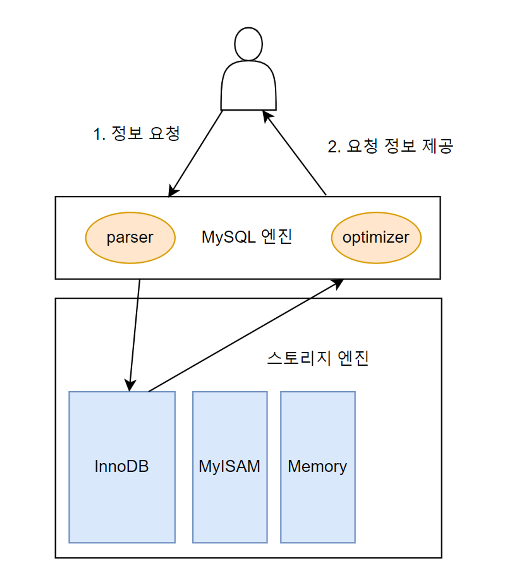

# [인프런] 업무에 바로 쓰는 SQL 튜닝

<br><br>
## 사전 준비
### MySQL 설치
- 도커로 설치
    - docker pull mysql
- 컨테이너 실행
    - docker run --name mysql-container -e MYSQL_ROOT_PASSWORD=1234 -d -p 3306:3306 mysql
- 파일 실행을 위한 환경설정
  - ```
    -- 컨테이너 접속
    docker exec -it mysql-container bash
    
    -- 계정 접속
    mysql -uroot -p

    -- 권한 설정
    GRANT ALL PRIVILEGES ON *.* TO 'root'@'%' IDENTIFIED BY 'admin' WITH GRANT OPTION;
    
    -- 설정 적용
    FLUSH PRIVILEGES;
    ```
### 실습 데이터 추가
- 실습 데이터 경로
  - https://github.com/7e7ey/Lecture-SQLtune.kit/tree/main/ch01-실습환경
- 데이터 추가
  - ```
    docker exec -i mysql-container mysql -uroot -p1234 < /Users/choi/Downloads/tmp/data_setting.sql
    docker exec -i mysql-container mysql -uroot -p1234 < /Users/choi/Downloads/tmp/dept.sql
    docker exec -i mysql-container mysql -uroot -p1234 < /Users/choi/Downloads/tmp/emp.sql
    docker exec -i mysql-container mysql -uroot -p1234 < /Users/choi/Downloads/tmp/grade.sql
    
    docker exec -i mysql-container mysql -uroot -p1234 < /Users/choi/Downloads/tmp/emp_hist1.sql
    docker exec -i mysql-container mysql -uroot -p1234 < /Users/choi/Downloads/tmp/emp_hist2.sql
    
    docker exec -i mysql-container mysql -uroot -p1234 < /Users/choi/Downloads/tmp/sal1.sql
    docker exec -i mysql-container mysql -uroot -p1234 < /Users/choi/Downloads/tmp/sal2.sql
    docker exec -i mysql-container mysql -uroot -p1234 < /Users/choi/Downloads/tmp/sal3.sql
    docker exec -i mysql-container mysql -uroot -p1234 < /Users/choi/Downloads/tmp/sal4.sql
    docker exec -i mysql-container mysql -uroot -p1234 < /Users/choi/Downloads/tmp/sal5.sql
    docker exec -i mysql-container mysql -uroot -p1234 < /Users/choi/Downloads/tmp/sal6.sql
    ```

<br>

## 학습정리
### 물리엔진
- 
  - 구성
    - MySQL의 엔진은 크게 MySQL 엔진과 스토리지 엔진으로 구분된다.
    - MySQL 엔진
      - MySQL 엔진은 사용자가 요청한 SQL문을 넘겨받은 뒤 SQL 문법 검사와 적절한 오브젝트 활용 검사를 한다.
      - SQL 문을 최소 단위로 분리하여 원하는 데이터를 빠르게 찾는 경로를 모색하는 역할을 수행한다.
    - 스토리지 엔진
      - 사용자가 요청한 SQL문을 토대로 DB에 저장된 디스크나 메모리에서 필요한 데이터를 가져오는 역할을 수행한다.
      - 일반적으로 온라인상의 트랜잭션 발생으로 데이터를 처리하는 OLTP(online transaction processing) 환경이 대다수인 만큼 주로 InnoDB 엔진을 사용한다.
